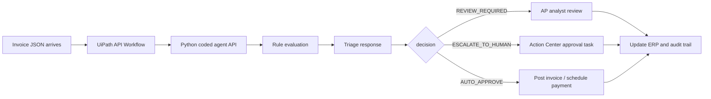

# Architecture

## Purpose

Invoice Exception Triage Agent demonstrates a governed invoice exception workflow for UiPath AgentHack 2026. The coded agent makes a deterministic invoice decision, while UiPath is responsible for orchestration, approvals, logs, and case visibility.

## High-Level Flow

## Components

| Component | Location | Responsibility |
| --- | --- | --- |
| Invoice loader | `src/invoice_agent/extraction.py` | Validates and normalizes invoice JSON. |
| Risk rules | `src/invoice_agent/risk_rules.py` | Applies deterministic AP exception rules. |
| Decision engine | `src/invoice_agent/decision_engine.py` | Converts flags into risk level, decision, action, and audit summary. |
| Audit report | `src/invoice_agent/audit_report.py` | Writes JSON or Markdown audit records. |
| API / CLI | `src/invoice_agent/api.py` | Exposes FastAPI endpoint when available and dependency-light CLI in all cases. |
| Mock ERP data | `data/mock_erp/` | Approved suppliers, purchase orders, and processed invoice IDs. |
| UiPath notes | `uipath/` | API Workflow, Studio Web, and Maestro BPMN setup guidance. |

## Deterministic Decision Model

The agent uses rule-based evaluation rather than probabilistic generation. This is deliberate for AP governance:

- same input plus same reference data produces the same output;
- rules are transparent and testable;
- reasons are plain English and suitable for human review;
- machine-readable flags are stable for BPMN branching and dashboard metrics.

## Risk Rules

| Rule | Code | Severity |
| --- | --- | --- |
| Duplicate invoice ID | `DUPLICATE_INVOICE_ID` | HIGH |
| Missing supplier tax ID | `MISSING_SUPPLIER_TAX_ID` | MEDIUM |
| Supplier not approved | `SUPPLIER_NOT_APPROVED` | HIGH |
| Invoice amount exceeds PO amount | `INVOICE_AMOUNT_EXCEEDS_PO` | HIGH |
| Suspicious payment terms | `SUSPICIOUS_PAYMENT_TERMS` | MEDIUM |
| Currency mismatch | `CURRENCY_MISMATCH` | HIGH |
| Missing or unknown PO | `MISSING_PO` | HIGH |

## Decision Policy

| Condition | Risk level | Decision |
| --- | --- | --- |
| No flags | LOW | `AUTO_APPROVE` |
| Only limited medium-severity flags | MEDIUM | `REVIEW_REQUIRED` |
| Any high-severity flag or 3+ total flags | HIGH | `ESCALATE_TO_HUMAN` |

## UiPath Integration Boundary

This repository provides the coded engine and integration contract. In a UiPath tenant, the intended boundary is:

1. API Workflow receives invoice JSON from Maestro.
2. API Workflow calls the hosted Python service.
3. API Workflow returns the triage JSON to Maestro.
4. Maestro branches on `decision`.
5. Action Center is used for high-risk approvals.

No tenant-specific credentials or deployed UiPath process are included.

